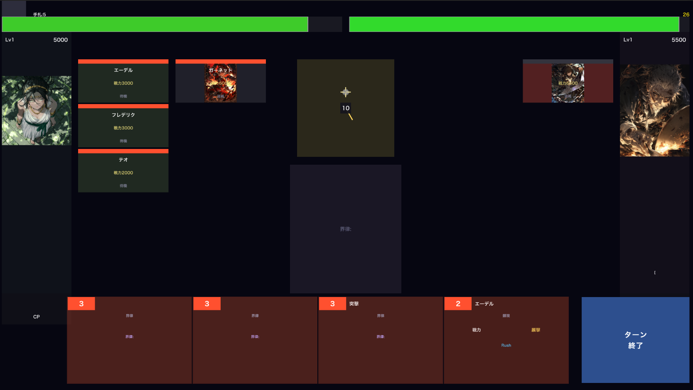

# 万願果（ばんがんか）— 1v1対戦デジタルTCG

> **「願いは、追い詰められるほど強くなる」**
> 追い詰められた願主が覚醒し、試合をひっくり返す——運ではなく、自分の判断で願いを通す対戦TCG。

**企画・設計・実装**: 内山 茂樹
**プラットフォーム**: Nintendo Switch / PS5 / PC / iOS / Android（基本プレイ無料）

---

## バトル画面

<p align="center">
  
</p>

## ゲーム概要

万願果は、HPが削られるほど願主（リーダー）が成長する逆転メカニクスを核とした1v1対戦デジタルTCG。

- **願力カード閾値** — HPが閾値を下回ると伏せカードが発動。攻める側は「相手を追い詰めるほど相手が強くなる」リスクを常に抱える
- **界律（Algorithm）** — 盤面中央に1枚だけ存在する共有フィールドルール。上書き式で、設置者にボーナスがある。「いつ上書きするか」が戦略の鍵
- **願主成長** — 試合中にレベルアップし、固有スキルを解放。CPをカードプレイに使うか成長に使うかのリソース判断
- **2層勝利条件** — 直撃勝利（HP0で追撃即勝利）と判定勝利（24ターン後HP比較）で攻守のジレンマを構造的に保証

### 6人の願主

| 願主 | 願相 | 願い | アーキタイプ |
|------|------|------|------------|
| Aldric | 曙（赤） | 滅ぼした民を蘇らせたい | 速攻・波状攻撃 |
| Vael | 空（青） | 自分がここにいた証を残したい | 妨害・制圧 |
| 灯凪 | 穏（緑） | 自分の物語を誰かに届けたい | 堅実・全体バフ |
| Amara | 妖（紫） | 自分が作った世界を消したい | 自壊・墓地蓄積爆発 |
| Rahim | 遊（黄） | 亡くした姉を蘇らせたい | 再演・リソース循環 |
| 崔鋒 | 玄（白） | 敗者の歴史を記録に残したい | 耐久・殉陣 |

各願主の「願い」がゲームメカニクスに直結。キャラクターへの感情移入がデッキ選択の動機になる。

<p align="center">
  
  
  
  
  
  
</p>

---

## 技術構成

| レイヤー | 技術 | 役割 |
|----------|------|------|
| クライアント | Unity (C#) | ゲームUI・演出・バトルビジュアル |
| サーバーロジック | Cloud Functions (TypeScript) | コマンド検証・マッチメイキング・AI |
| リアルタイム同期 | Firebase RTDB | バトル中の状態同期 |
| データベース | Cloud Firestore | カードマスタ・ユーザーデータ・マッチ履歴 |
| 認証 | Firebase Auth | Apple / Google Sign-in |

### コードベース

| 言語 | ファイル数 | 行数 |
|------|----------|------|
| C# (クライアント) | 118 | ~36,500 |
| TypeScript (サーバー) | 7 | ~4,000 |
| カードデータ JSON | 162 | — |
| 設計書 Markdown | 68 | — |

---

## 実装済み機能

- **バトルエンジン** — 全ルール実装（願力カード、界律、願主成長、奇襲）
- **AI対戦** — 3段階難易度のBot AI
- **オンライン対戦** — Firebase RTDB によるリアルタイム同期
- **デッキ構築** — 6色×3タイプ×情相タグによる構築自由度
- **パック開封** — レアリティ別演出付きカード開封
- **ランクマッチ** — 26段ランクシステム・ELOベースマッチメイキング
- **ドラフトモード** — 30枚ドラフト選択・最大5勝2敗制
- **ストーリーモード** — 全6章（各願主の物語）
- **バランスシミュレーション** — 108,000戦の自動対戦で先攻勝率45〜55%を検証

---

## ディレクトリ構成

```
banganka-tcg/
├── Assets/
│   ├── Scripts/                # Unity C# ソースコード
│   │   ├── Core/               #   バトルエンジン・データ・ネットワーク
│   │   ├── UI/                 #   画面・演出・カード表示
│   │   ├── Game/               #   ゲーム管理・ブートストラップ
│   │   ├── Audio/              #   サウンド管理
│   │   └── Tests/              #   ユニットテスト
│   └── StreamingAssets/
│       ├── Cards/              # 162種のカードデータ (JSON)
│       └── CardData/           # マスタデータ
├── functions/
│   └── src/                    # Cloud Functions (TypeScript)
├── Docs/
│   ├── Proposal/               # 企画書・分析レポート
│   └── GameDesign/             # 詳細設計書 (68ドキュメント)
├── firestore.rules             # Firestoreセキュリティルール
└── database.rules.json         # RTDBセキュリティルール
```

---

## 設計書

企画書と主要な設計書は `Docs/` に格納しています。

| ドキュメント | 内容 |
|-------------|------|
| [企画書（万願果）](Docs/Proposal/企画書_万願果.md) | ゲームコンセプト・ルール・世界観・バランス設計・演出設計 |
| [GAME_DESIGN.md](Docs/GameDesign/GAME_DESIGN.md) | ゲームルール正本（v0.5.5） |
| [CARD_SCHEMA.md](Docs/GameDesign/CARD_SCHEMA.md) | カードデータ構造定義 |
| [BALANCE_POLICY.md](Docs/GameDesign/BALANCE_POLICY.md) | バランス設計方針 |
| [STORY_BIBLE.md](Docs/GameDesign/STORY_BIBLE.md) | 世界観・ストーリー設定 |

---

## バランス設計の思想

- **コストカーブ**: `基準戦力 = CP × 2000 + 1000`。全カードをこの数式ベースで設計し、パワーインフレを構造的に防止
- **先攻/後攻補正**: 特定カードの強化ではなく、手札枚数（先攻5枚/後攻6枚）というシステムレベルで補正
- **レアリティ ≠ 強さ**: レアリティは入手難易度のみ。Commonでも構築の核になる設計

---

## ライセンス

本リポジトリは個人のポートフォリオ・創作物として公開しています。
ソースコードの閲覧・参考は自由ですが、商用利用・再配布はご遠慮ください。

All rights reserved. (c) 2026 Shigeki Uchiyama
